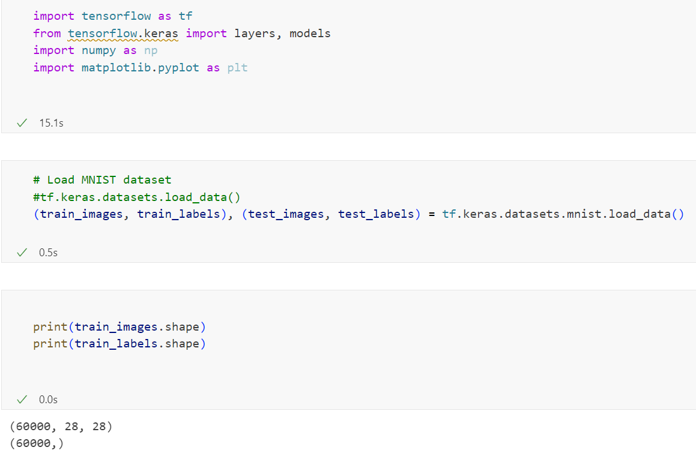
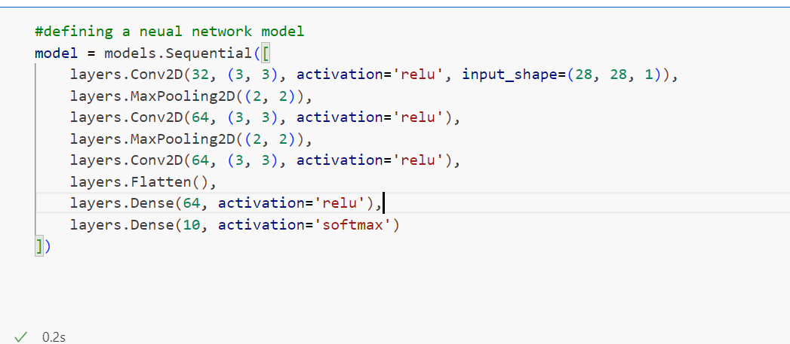
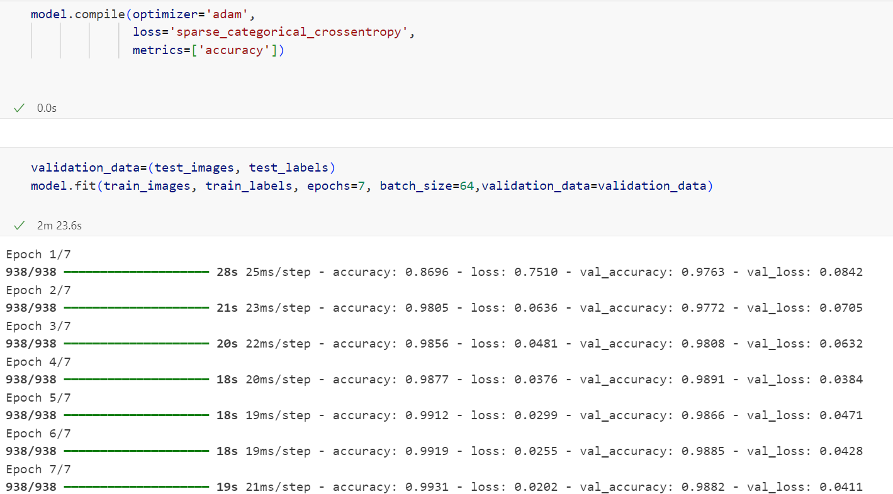
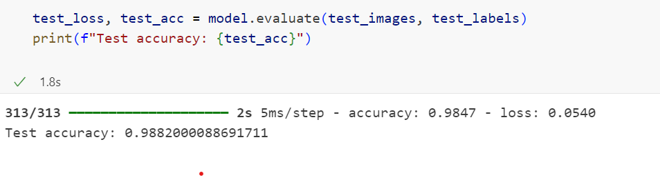

# Handwriting Recognition Classifier

This project implements a Convolutional Neural Network to classify handwritten digits from the MNIST dataset using TensorFlow and Keras.

---

## Features
1. **Dataset**: 
   - 28x28 grayscale images of handwritten digits.
2. **Model Architecture**:
   - Convolutional Layers: with ReLU activation.
   - Pooling Layers: To reduce dimensionality.
   - Fully Connected Layers: classification.
   - Output Layer: Softmax 
3. **Model Training**:
   - Optimizer: Adam.
   - Loss Function: Sparse categorical crossentropy.
   - Metrics: Accuracy.
4. **Evaluation**:
   - Validates the model on the test dataset and reports accuracy.

---

## Results
- The model is trained for 7 epochs with a batch size of 64.
  
  ### Load Dataset
- 
  
  ### Neural Network
- 

  ### Training the model
- 

  ### Output accuracy
- 

---

## Requirements
Install the dependencies
```bash
pip install tensorflow matplotlib numpy
```
Start the python script
```bash
python app.py
```

